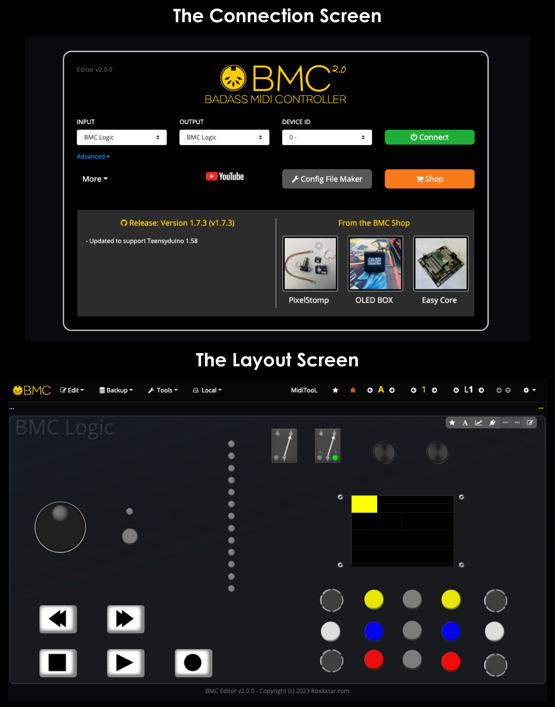
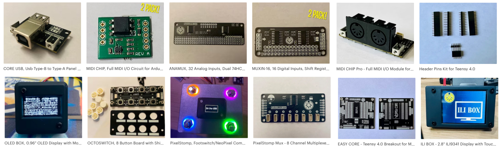

**Licensed under the MIT license.**

*See LICENSE file in the project root for full license information.*

[Official BMC Website >> RoxXxtar.com/bmc](https://www.roxxxtar.com/bmc)

# BMC 2.0 is Here!
## BMC the Badass MIDI Controller For Teensy 3.x, 4.x & Teensy Micromod!

***BMC 2.0 is NOT compatible with previous versions of BMC, BMC 2.0 is a major re-write and re-architectured of the core, if you have a device with a previous version of BMC you will need to create a new config file. For more info on what's changed and why see:***

**PLEASE READ THIS DOCUMENT FIRST, SPECIALLY THE [INSTALLATION](#installation) REQUIREMENTS FOR THE LIBRARY, BMC REQUIRES TEENSYDUINO AND THE BMC FOR TEENSY BOARDS TO BE INSTALLED.**

**YOU CAN DOWNLOAD THE BMC LIBRARY FROM THE ARDUINO LIBRARY MANAGER AND KEEP IT UP TO DATE THERE!**

### Get BMC updates on Facebook [https://www.facebook.com/badassmidi](https://www.facebook.com/badassmidi)

***You can access they web-based editor at [https://www.RoxXxtar.com/bmc](https://www.roxxxtar.com/bmc)***

***The editor app runs on Google Chrome and requires internet access the first time, after that you can instal the app on your computer as a chrome app***

---


# Introduction

The Badass MIDI Controller (BMC) Library represents a comprehensive MIDI Controller solution meticulously crafted for the Teensy Platform, complemented by a dedicated Desktop Editor App.

BMC empowers users with the seamless integration of Buttons/Footswitches, Rotary Encoders, Potentiometers/Expression Pedals, LEDs, WS2812 Addressable LEDs, Relays, OLED displays, and the ILI9341 Touch Displays. This versatile library facilitates the customization of functions for each component through a user-friendly desktop application.

Designed with the intent of simplifying the creation of Hardware MIDI Controllers powered by Teensy, BMC offers an intuitive firmware customization process tailored to your specific hardware requirements. Notably, the library provides a Graphic User Interface (GUI) within the Editor App, enabling effortless modifications such as altering button pins or integrating additional hardware elements, without necessitating manual code composition.

BMC eliminates the need for manual coding or advanced programming skills. The firmware seamlessly manages configurations through a user-generated desktop application file. For proficient programmers, BMC further extends its capabilities with an Application Programming Interface (API), facilitating the incorporation of custom code into the sketch and interaction with BMC functionalities.

BMC 2.0 is compatible with the Following Teensy Models:
* Teensy Micromod
* Teensy 4.1
* Teensy 4.0
* Teensy 3.6
* Teensy 3.5
* Teensy 3.2

Some of BMC's key Features Include:

* **USB and USB Host MIDI** BMC leverages Teensy's USB MIDI to communicate with the editor app and also to control MIDI apps on your computer, in addition Teensy boards with USB Host support (Teensy 4.x, Micromod and Teensy 3.6) can use the host usb to send/receive MIDI.

* **4 Serial MIDI Ports** you can have up to 4 independent Standard/Legacy MIDI Ports.

* **Automatic Handling of EEPROM** either using the built-in EEPROM, SD Card (on boards that have it) or with a 24LC256 i2c EEPROM Chip. EEPROM is where all editable data lives.

* **Automatic Handling of Reading and Controlling all basic hardware** in other words, if you want to add footswitches you don't have to write any of the code to read the footswitch, BMC will do all of it just stomp away!

* **Sync** BMC can sync to your Fractal Axe FX II or AX8, Logic Pro and more.

---

## DOCUMENTATION
Undoubtedly, this project is expansive and ambitious, necessitating an extensive documentation effort. The Editor App is rich with detailed information on events for buttons, LEDs, and other components, offering an invaluable resource for users. Additionally, the library itself is thoughtfully annotated with abundant comments within the code, enhancing clarity and comprehension.

For better management all BMC Documentation has been moved to [https://www.roxxxtar.com/bmc](https://www.roxxxtar.com/bmc)

---

## The Editor App


### You can now get the BMC Editor App for iPad!
<p align="center">
  <a href="https://www.roxxxtar.com/?urlrefcode=58a6d4b18f998172d83f3171d43b465f" target="_blank">
    
  </a>
</p>
<p align="center">Purchasing the Editor App supports BMC development.</p>




---

## Support BMC Development

To support BMC Development you can can buy MIDI Modules and Accessories from the BMC Shop @ [BadassMIDI.com](http://www.badassmidi.com)

[](https://www.roxxxtar.com/badassmidi)
---

**Watch BMC Videos on [YouTube](https://www.youtube.com/channel/UCDl3gSF3X0cuXY3fBwXpQYA)**

---

## 3rd Party Dependencies
BMC will use many libraries included with Teensyduino, however, here are some of the 3rd party libraries it uses.

* Arduino MIDI Library (Version 5.0 or later)
* QueueArray Library (bundled with BMC)
* i2c EEPROM Library (bundled with BMC)
* BLEPeripheral Library for nRF8001 (download at [https://github.com/neroroxxx/arduino-BLEPeripheral](https://github.com/neroroxxx/arduino-BLEPeripheral), you must instal from this url as it's a modified version of the library.)
* Source code has comments with credits if the code comes from another library, if I missed any please let me know.

---

## Installation
Moved to [https://www.roxxxtar.com/blog/articles/2023/05/05/installing-teensyduino-and-bmc-on-arduino-2-0](https://www.roxxxtar.com/blog/articles/2023/05/05/installing-teensyduino-and-bmc-on-arduino-2-0)

---

## Coding
All pre-processors/macros are all uppercase with underscores between words and are always prefixed **BMC_** this is to avoid issues with other libraries.

```c++
#define BMC_MIDI_CONTROL_CHANGE 0xB0
```

All classes are prefixed `BMC` in camelCase with the first letter capital, Example:

* `BMCMidi`
* `BMCTimer`
* `BMCFlags`
* `BMCMidiMessage`

The **"store"** struct and all it's member structs are prefixed with **bmcStore** and are camelCase this is to tell them apart from classes and other structs. Example:

* `bmcStore`
* `bmcStoreGlobalCustomSysEx`

Some of the macros, classes and function names may be long but I want them to be as easy to read and understand their purpose as possible.

## Library File Structure
The BMC library is split into multiple folders and multiple files,
I refer to the "**src**" folder in the library as the "**root**" folder.

The main class is the **BMC** class, this class is split into one header **BMC.h** and
multiple implementation files **(.cpp)** in order to keep the code manageable.
For example the file named **BMC.cpp** contains the class initialization, the **begin**
method and the **update** method, while **BMC.midi.cpp** handles reading the MIDI Ports.

Additionally the **API** is it's own class, `BMCApi`, this is the class you want to use if you want to use any API calls.

You can also just use an instance of `BMC` if you won't be using the API.

You can also use this macro to initialize the API.

```c++
// this macro creates an instance of BMCApi named bmc
BMC_DEFAULT();
```

The above is the equivalent of:

```c++
BMCApi bmc = BMCApi();
```
---

## About BMC
The genesis of BMC can be traced back to 2017 when I embarked on the journey of constructing a personalized MIDI Controller synchronized seamlessly with my Fractal AX8 guitar processor. My initial attempts using an Arduino Mega revealed a dearth of user-friendly libraries for developing an editor app tailored to modify the footcontroller's buttons.

Motivated by this, I ventured into creating a specialized editor app for the device. Being primarily a Web Programmer, I opted for MIDI as the communication protocol due to its compatibility with Google Chrome, facilitating the swift assembly of an application. However, the caveat was the necessity of a Serial MIDI to USB adaptor or Serial to MIDI Software for Arduino communication.

The quest for boards with pre-implemented USB MIDI capabilities led me to discover the Teensy Platform and its array of boards, which not only surpassed Arduino in size and speed but also offered an abundance of built-in features, particularly USB MIDI.

Armed with a pair of Teensys, my focus shifted to enhancing the editor, enabling direct data editing on the EEPROM without requiring sketch re-uploads. As aspirations expanded to encompass a more extensive foot controller with additional buttons and pots, the need for entirely new code arose. This instigated the concept of a master Configuration File, enabling the library's adaptability to the specifications of my evolving device.

Subsequent to the inception of the original BMC version, my inclination for perfection led me to undertake four complete rewrites, culminating in the current iteration. Reflecting on my journey, I recognized that having a library like BMC from the project's inception would have granted me more time for guitar playing and less time devoted to coding and testing—an insight that spurred my decision to document and open-source BMC for broader utilization.

While I've strived to ensure BMC's user-friendliness, acknowledging my proficiency limitations in C++ and the code base's imperfections compared to that of seasoned C++ programmers, I invite collaboration and contributions to further optimize and refine BMC. Your expertise can play a crucial role in enhancing the functionality and accessibility of BMC for the wider community.

---

If you're a seasoned C++ programmer who wants to collaborate and make BMC as powerful as possible please feel free to contact me @ [https://www.RoxXxtar.com/contact](https://www.roxxxtar.com/contact) to discuss ideas and improvements to the code.

**If you have any experience with HUI control and would like to help me implement it's functionality in BMC please email me at [https://www.RoxXxtar.com/contact](https://www.roxxxtar.com/contact)**

For more info on BMC and to access the editor you can visit the official site at [https://www.RoxXxtar.com/BMC](https://www.roxxxtar.com/bmc)
