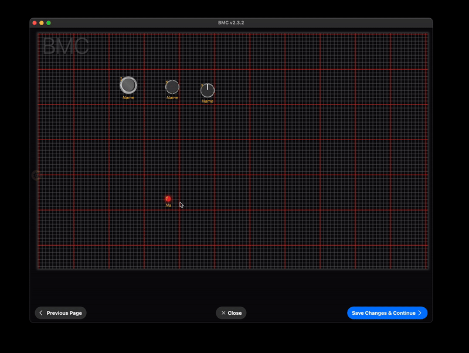

# **Badass MIDI Controller (BMC)**

[Official BMC Website @ BadassMIDI.com](http://www.badassmidi.com/)

## BMC 2.0 is Here! 🚀
### For Teensy 3.x, 4.x & Teensy Micromod ([BMC now supports some ESP32 boards!](#esp32-support))

⚠ **BMC 2.0 is NOT compatible with previous versions of BMC!, you will need to create a new config file and backups for older versions are not compatible.**

BMC 2.0 is a major re-write of the BMC core. If you're upgrading from an older version, you'll need to create a new config file. Learn more about the changes [here](#documentation).

📌 **Before proceeding, please review the [Installation](#installation) requirements!**

✅ **Download the BMC library directly from the Arduino Library Manager.**

### 📢 Stay Updated!
🔹 [Follow BMC on Facebook](https://www.facebook.com/badassmidi)
🔹 [Follow BMC on Instagram](https://www.instagram.com/badassmidi)  
🔹 [Watch BMC Videos on YouTube](https://www.youtube.com/channel/UCDl3gSF3X0cuXY3fBwXpQYA)  
🔹 [Access the Web Editor](https://www.roxxxtar.com/bmc) (Google Chrome required)  

---

## Table of Contents
- [Changelog](CHANGELOG.md)
- [What is BMC](#what-is-bmc)
- [Supported Boards](#supported-boards)
- [ESP32 Support](#esp32-support)
- [Key Features](#key-features)
- [Documentation](#documentation)
- [BMC Editor App](#bmc-editor-app)
- [Installation](#installation)
- [Library Structure & Coding Style](#library-structure--coding-style)
- [About BMC](#about-bmc)
- [Contribute to BMC](#contribute-to-bmc)
- [License](#license)

---

## What is BMC?
BMC (**Badass MIDI Controller**) is a powerful MIDI controller library designed for **Teensy** boards ([now supporting ESP32!](#esp32-support)). It comes with a **companion editor app** that lets you design your MIDI controller’s hardware and UI **without writing code**. 

### How It Works
1. **Design Your MIDI Controller** 🛠️  
   - Specify buttons, LEDs, potentiometers, encoders, displays, MIDI ports, and more.
   - Configure the **UI layout** to match your physical hardware setup.
   - Customize the UI elements (e.g., different button styles and colors).
2. **Compile & Upload** 🚀  
   - BMC generates a **config.h** file that defines your controller setup.
   - The library compiles with this config file to enable only the required features.
3. **Edit & Manage** 🎛️  
   - Use the editor app to modify settings and  data in EEPROM—no need to re-upload code!

✅ **No coding required!** BMC handles everything behind the scenes.  
💡 Advanced users can extend functionality using the **BMC API**.

---

## Supported Boards
- Teensy **Micromod**
- Teensy **4.1**
- Teensy **4.0**
- Teensy **3.6** *(⚠ Not recommended for new designs)*
- Teensy **3.5** *(⚠ Not recommended for new designs)*
- Teensy **3.2** *(⚠ Not recommended for new designs)*
- ✨ **NEW!** ESP32 Devkit V1 (Beta)
- ✨ **NEW!** SparkFun ESP32 (Beta)
- ✨ **NEW!** ESP32-S2 Devkit(Beta)
- ✨ **NEW!** ESP32-S3 Devkit (Beta)


---

### ESP32 Support

BMC now supports multiple ESP32 models, including models with **OTG USB** all are currently in Beta.

- **ESP32 (Original)**  
  - ❌ No native USB MIDI  
  - ✅ BLE MIDI only (enabled automatically)
- **ESP32-S2 / ESP32-S3**  
  - ✅ Native USB MIDI support (enabled automatically)  
  - ✅ BLE MIDI also enabled automatically
- On **ESP32 (original)**, **BLE MIDI replaces USB MIDI**.
- On **ESP32-S2/S3**, **USB MIDI works as expected**, and **BLE MIDI is also available**.
- BLE MIDI is **always enabled**, regardless of variant.
- Only **2 serial ports** are available on all ESP32 boards.
- The **Serial Monitor** is **not available** in the Arduino Web Editor or iPad app.
- Internal **EEPROM size is fixed** at **4,096 bytes**.
- The **BMC for ESP32 Boards package** is a modified version of the official ESP32 package:
  - Both packages can coexist.
  - When using a BMC board, a `config.h` file **must** exist in the sketch folder.
  - This package includes:
    - [NimBLE](https://github.com/h2zero/NimBLE-Arduino) for BLE MIDI
    - [TinyUSB](https://github.com/hathach/tinyusb) for USB MIDI
- When selecting an ESP32-S2 or ESP32-S3 board from the **BMC for ESP32 Boards package**, all necessary USB MIDI settings are **automatically configured**.
- All BMC features are currently Supported on ESP32.

---

## Key Features
✅ **MIDI Communication**  
   - USB & USB Host MIDI support for controlling DAWs and MIDI apps (Teensy Only).
   - Up to **4 Serial MIDI Ports** (1 on ESP32) for legacy devices.
   - Bluetooth Low Energy (BLE) MIDI with added MIDIBLE module (always available on ESP32)
✅ **Automatic Hardware Management**  
   - Reads buttons, encoders, pots, LEDs, and displays **without extra coding**.
✅ **EEPROM Handling**  
   - Supports **built-in EEPROM**, **external I2C EEPROM (24LC256)**, or **built-in SD Card Reader**.
✅ **MIDI Sync**  
   - Syncs with **Fractal Axe FX II**, **AX8**, **Logic Pro**, and more!

---

## Documentation
For complete documentation, visit:  
📌 [BMC Documentation](https://www.roxxxtar.com/bmc-documentation)

---

## BMC Editor App

🎉 **Get the BMC Editor App for iPad!** 🎉

<a href="https://www.roxxxtar.com/?urlrefcode=58a6d4b18f998172d83f3171d43b465f" target="_blank">
  
</a>

Purchasing the app **supports BMC development**! ❤️


Creating a layout that matches your hardware is easy!



---

## Support BMC Development
Help improve BMC by purchasing MIDI modules & accessories at [BadassMIDI.com](http://www.badassmidi.com)!

[](https://www.roxxxtar.com/badassmidi)

---

## Installation
📌 Follow the installation guide here:  
[Installing Teensyduino & BMC on Arduino 2.0](https://www.roxxxtar.com/blog/articles/2023/05/05/installing-teensyduino-and-bmc-on-arduino-2-0)

---

## Library Structure & Coding Style
✅ **Macros**: Prefixed with `BMC_`, uppercase with underscores.
```c++
#define BMC_MIDI_CONTROL_CHANGE 0xB0
```

✅ **Class Naming**: Prefixed with `BMC`, using camelCase.
```c++
BMCMidi, BMCTimer, BMCFlags, BMCMidiMessage
```

✅ **Struct Naming**: Prefixed with `bmcStore`.
```c++
bmcStore, bmcStoreGlobalCustomSysEx
```

✅ **Default API Initialization**:
```c++
// Creates an instance of BMCApi named bmc
BMC_DEFAULT();
// Equivalent to:
BMCApi bmc = BMCApi();
```

✅ **The only code your Sketch needs!**:
```cpp
#include <BMC.h>

BMC_DEFAULT();

void setup(){
  bmc.begin();
}

void loop(){
  bmc.update();
}
```
---

## About BMC
BMC started in **2017** as a custom MIDI controller project for a **Fractal AX8** guitar processor. After struggling with Arduino libraries, the need for an easy-to-use editor app became clear. 

💡 **Why Teensy?**  
Teensy boards were the perfect solution due to their **built-in USB MIDI support** and superior **performance** compared to standard Arduinos.

Since then, BMC has evolved into a powerful **no-code MIDI controller framework** that saves time and effort, letting users focus on music instead of programming!

---

## Contribute to BMC
Are you a **C++ programmer**? Want to improve BMC? 
Contact me here: [RoxXxtar Contact Page](https://www.roxxxtar.com/contact)

💡 **HUI Control**: If you have experience with **HUI MIDI Control**, let’s collaborate! Email me at [RoxXxtar Contact Page](https://www.roxxxtar.com/contact).

📌 **More Info & Web Editor:** [RoxXxtar.com/BMC](https://www.roxxxtar.com/bmc)

---

## License
**MIT License**  
See the `LICENSE` file for details.
