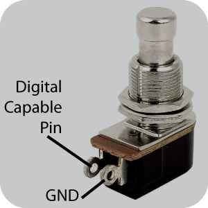

*Under MIT license.*

[Official BMC Website >> RoxXxtar.com/bmc](https://www.roxxxtar.com/bmc)

[< Back to Documentation](README.md)

# Buttons

Buttons are a powerful part of BMC, the best part if you ask me. BMC has 2 types of Buttons:

1. **Buttons** *which are part of pages*
2. **Global Buttons** *which don't change their event when pages change*

Buttons and Global Buttons behave exactly the same except Global Buttons will always have the same event(s) event when changing pages.



Within BMC each button can have up to 8 events, the number of events is specified in the Config File Maker, the compiled number of events applies to all page and global buttons.

A button event is what they will do, for example, change pages, sent a MIDI Message, turn an LED on/off etc.

Each event has it's own Trigger, the Trigger is the action that executes the event, these can be:

* **Press** *triggered once immediately when a button press has been detected (on state change)*
* **Alt/Second Press** *triggered once every other time the button is pressed, this trigger will alternate between the Press and Alt Press Events.*
* **Double Press** *triggered once when the button is pressed twice quickly*
* **Hold** *triggered once after holding the button for a set period of time*
* **Continuous** *triggered repeatedly while the button is held down*
* **Release (Always)** *Triggered when the button is depressed*
* **Release (after press only)** *Triggered when the button is depressed but only if the Press parameters were met, that is if the button was held long enough to trigger a HOLD event then this release type is excluded*
* **Release (after 2nd press only)** *Triggered when the button is depressed but only if the 2nd Press parameters were met*
* **Release (after double press only)** *Triggered when the button is depressed but only if the Double Press parameters were met*
* **Release (after hold press only)** *Triggered when the button is depressed but only if the Hold parameters were met*
* **Release (after continuous press only)** *Triggered when the button is depressed but only if the Continuous parameters were met*

A button can have any combination of Triggeres per event which would allow you execute one event when the button is pressed and another when the button is depressed, etc.

### Hold Threshold
You can change how long you have to hold the button down before triggering it's HOLD events in the Editor's Settings.

### MIDI Ports
Each Button Event has it's own MIDI Port(s) which is where a MIDI Message is sent (if that event has is a MIDI event)

### Names
Each button can also have a name, this is optional and the number of characters of the name can be selected with the Config File Maker. Page and Global Buttons share the number of characters compiled and these all add to EEPROM.

### Dual Button Press
BMC also has the ability to detect 2 buttons being pressed at the same time, however this is handled differently than events.

If you want to detect 2 buttons being pressed at the same time you have to use the BMC API, the callback is `onButtonDualPress(callback)`

this callback is triggered any time 2 buttons are pressed simultaneously for this example I'll check if the first and second button where pressed at the same time, remember BMC is inclusive to Button #1 will be 0, #2 is 1, etc.

ALSO the lowest button index will always be in `btn1`, so if you want to check if buttons 1 and 2 where pressed at the same time in the callback you can always check if `btn1` is 0 and `btn2` is 1


```c++
// example sketch using the dual button press callback
#include <BMC.h>
BMC_DEFAULT();
void setup(){
  bmc.begin();
  bmc.onButtonDualPress(callback);
}

void callback(uint8_t btn1, uint8_t btn2){
  // this callback is triggered any time 2 buttons are pressed simultaneously
  // for this example I'll check if the first and second button where pressed
  // at the same time, remember BMC is inclusive to Button #1 will be 0, #2 is 1, etc.
  // ALSO the lowest button number will always be btn1, so if button #2 is detected
  // first and button #1 is detected second then "btn1" will carry the index of
  // button #1 and "btn2" will carry the index of button #2
  if(btn1==0 && btn2==1){
    BMC_PRINTLN("Buttons #1 and #2 were pressed simultanously");
    // do something here...
  }
}
void loop(){
  bmc.update();
}
```

for Global Buttons you can use `onGlobalButtonDualPress(callback)` just keep in mind you can not mix page and global buttons for dual press.

Dual Press is usually a feature that most MIDI controllers use to do things like go to a settings page, save data, change banks, etc. you can do all these things with the BMC API.

**NOTE:** any buttons that you intend to use for dual press shouldn't have *Press* events, this is because the *Press* events are executed immediately no matter what.

When a Dual Button press is detected BMC will ignore any events of those 2 buttons until they are both released, also the dual press detection is locked out until both buttons have been released.

### Delays between events
BMC also features delays between events, this feature must be compiled as it uses more RAM, you can do this in the advanced tab of the config file maker.

Delays will add a delay between events with the same trigger, that is if an event has a button has 3 events, all *Press* events, the first event will send a MIDI Program Change, the second event will have a Delay event of 10ms and Event 3 will have send a Control Change, in this case the program change is sent immediately then BMC will wait 10 seconds and then the control change is sent.

If the last event of the button is a delay then it will be ignored.

The delay event will only delay events with the same trigger type as the delay event, so if the delay is on *Release (Always)* then the next event after the delay with a *Release (Always)* trigger will be delay. **Only the very next event with that trigger type will be delayed, all other events are handled as usual, this feature may change over time.**

### API
There are many API callbacks and functions available for use, these may not reflect the latest version

##### CALLBACKS
```c++
// triggered when a button is pressed, released, etc.
// see src/hardware/BMC-ButtonsDualHandler.h for info on how this works.
void onButtonActivity(void (*fptr)(uint8_t n,
                              uint8_t eventIndex,
                              uint8_t pressType,
                              bmcStoreButton button,
                              bmcStoreButtonEvent data));

// triggered when an global button is pressed, released, etc.
// see src/hardware/BMC-ButtonsDualHandler.h for info on how this works.
void onGlobalButtonActivity(void (*fptr)(uint8_t n,
                                  uint8_t eventIndex,
                                  uint8_t pressType,
                                  bmcStoreButton button,
                                  bmcStoreButtonEvent data));

// triggered when 2 buttons are pressed at the same time
// see src/hardware/BMC-ButtonsDualHandler.h for info on how this works.
void onButtonDualPress(void (*fptr)(uint8_t btn1, uint8_t btn2));

void onGlobalButtonDualPress(void (*fptr)(uint8_t btn1, uint8_t btn2));

// triggered when a custom button event is handled
void onButtonCustomActivity(void (*fptr)(uint8_t n, uint8_t eventIndex, uint8_t byteA, uint8_t byteB, uint8_t byteC, uint8_t ports));

// triggered when a custom global button event is handled
void onGlobalButtonCustomActivity(void (*fptr)(uint8_t n, uint8_t eventIndex, uint8_t byteA, uint8_t byteB, uint8_t byteC, uint8_t ports));

// for user defined events, includes page and global
void onButtonsUserEvent(void (*fptr)(uint8_t n, uint32_t event, uint8_t ports, uint8_t mode));
```

##### FUNCTIONS
```c++
// Get a button's data on the current page
// @t_index the index of the button you want to retrieve
// @t_item a reference to the bmcStoreButton to put data in
void getButton(uint8_t t_index, bmcStoreButton& t_item);

// get button data of a specific page
void getButton(uint8_t t_page, uint8_t t_index, bmcStoreButton& t_item);

// get button name in the current page
// @n the index of the button
// @t_string a pointer to a string to put the button name in
// see "advanced names and strings" documentation for length of char string
void getButtonName(uint8_t n, char* t_string);

// get button name of a specific button
// see "advanced names and strings" documentation for length of char string
void getButtonName(uint8_t t_page, uint8_t n, char* t_string);

// Trigger a button being pressed, this button will remain pressed until you call triggerButtonRelease
// @n the index of the button being triggered
void triggerButtonPress(uint8_t n);

// Trigger a button being depressed, this function will only work on the button if triggerButtonPress was called before
// @n the index of the button being triggered
void triggerButtonRelease(uint8_t n);

// Get a global button's data
// @t_index the index of the button you want to retrieve
// @t_item a reference to the bmcStoreButton to put data in
void getGlobalButton(uint8_t t_index, bmcStoreButton& t_item);

// get global button name
// @n the index of the button
// @t_string a pointer to a string to put the button name in
// see "advanced names and strings" documentation for length of char string
void getGlobalButtonName(uint8_t n, char* t_string);

// Trigger a global button being pressed, this button will remain pressed until you call triggerButtonRelease
// @n the index of the button being triggered
void triggerGlobalButtonPress(uint8_t n);

// Trigger a global button being depressed, this function will only work on the button if triggerButtonPress was called before
// @n the index of the button being triggered
void triggerGlobalButtonRelease(uint8_t n);

// Change the Buttons Hold Time Setting for Buttons
// if @save is true it will call the settingsSave() writing the store to EEPROM
// @value must be a value from 0 to 15, where 0 is 500ms, 1 is 750ms, 2 is 1000ms, etc.
// each value after 0 adds 250ms to the hold time.
// When the value is passed to buttons the actual hold threshold is ((value+2)*250)
// this is so that with a value of 0 the hold threshold is 500ms, that's the minimum
// since during testing i've found that a value any lower than that is unusable.
void settingsSetButtonHold(uint8_t value, bool save=false);

// Get the Buttons Hold Threshold Setting for Buttons
// this value will range from 0 to 15
// to get the actual time in milliseconds set inMillis to true
uint8_t settingsGetButtonHold(bool inMillis=false);
```
