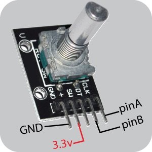

*Under MIT license.*

[Official BMC Website >> RoxXxtar.com/bmc](https://www.roxxxtar.com/bmc)

[< Back to Documentation](README.md)

# Encoders
You can use Rotary encoders with BMC, they are automatically read by BMC, however they do not hold a "counter" of the current value, BMC just sees if the encoder was rotated up (clock-wise) or down (counter clock-wise) with this if your sketch requires to keep track of a value you can do it separately tho most functions within BMC don't require to know the counter of the encoder.



### API
There are many API callbacks and functions available for use, these may not reflect the latest version

##### FUNCTIONS
```c++
// Get ENCODER Data on current page
void getEncoder(uint8_t t_index, bmcStoreEncoder& t_item);

// Get ENCODER Data on specified page
void getEncoder(uint8_t t_page, uint8_t t_index, bmcStoreEncoder& t_item);

// get encoder name on current page passing a pointer string
// see "advanced names and strings" documentation for length of char string
void getEncoderName(uint8_t t_index, char* t_string);

// get encoder name on specified page passing a pointer string
// see "advanced names and strings" documentation for length of char string
void getEncoderName(uint8_t t_page, uint8_t t_index, char* t_string);
```

##### CALLBACKS
```c++
// triggered when an encoder is rotated
void onEncoderActivity(void (*fptr)(uint8_t index, bool increased, bmcStoreEncoder data));

// triggered when a custom encoder event is handled
void onEncoderCustomActivity(void (*fptr)(uint8_t index, uint8_t byteA, uint8_t byteB, uint8_t byteC, bool direction));

// triggered when a global encoder is rotated
void onGlobalEncoderActivity(void (*fptr)(uint8_t index, bool increased, bmcStoreEncoder data));

// triggered when a custom global encoder event is handled
void onGlobalEncoderCustomActivity(void (*fptr)(uint8_t index, uint8_t byteA, uint8_t byteB, uint8_t byteC, bool direction));

// for user defined events, includes page and global encoders
void onEncodersUserEvent(void (*fptr)(uint8_t n, uint32_t event, uint8_t ports, uint8_t mode));

```
