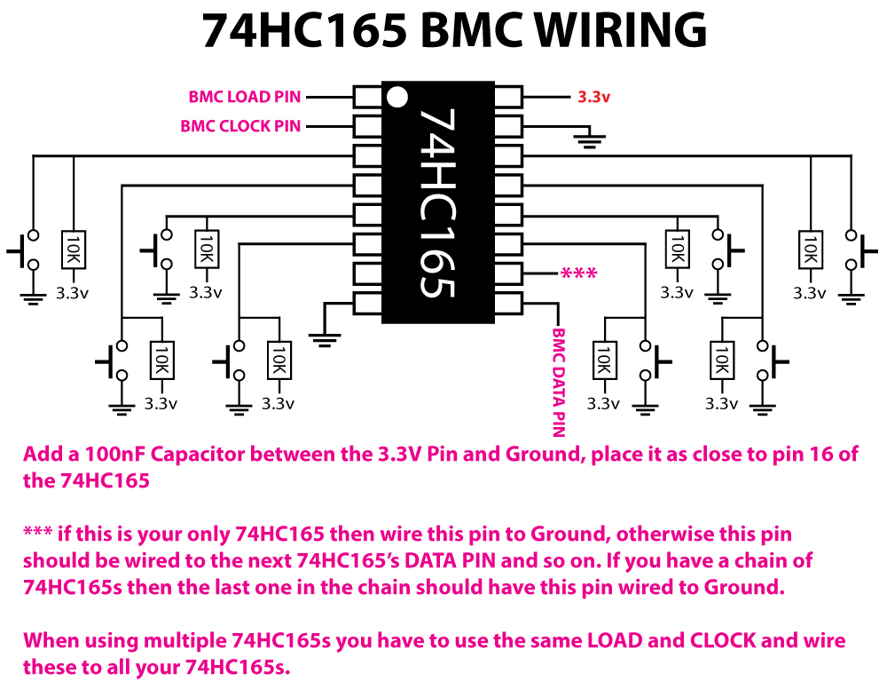
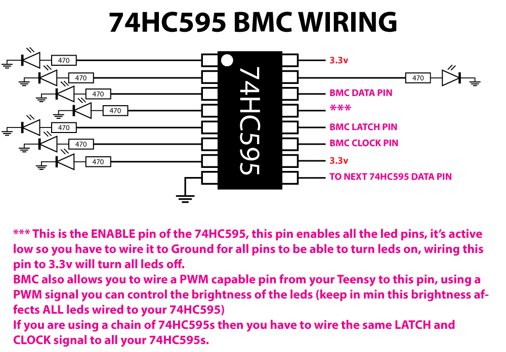
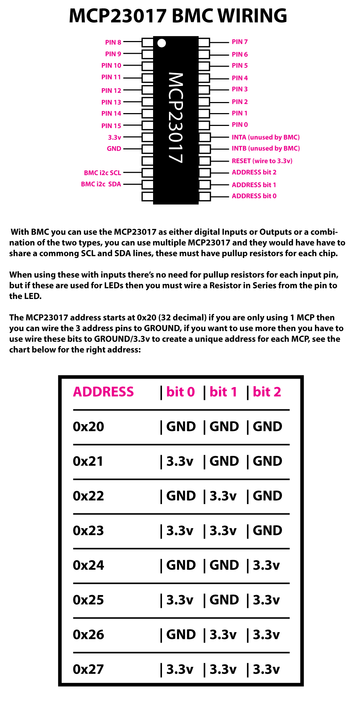

*Under MIT license.*

[Official BMC Website >> RoxXxtar.com/bmc](https://www.roxxxtar.com/bmc)

[< Back to Documentation](README.md)

- [Wiring Your Multiplexers](#wiring-your-multiplexers)

# Multiplexers
***********************************************
***BMC now allows for up to 127 Analog Mux Pins, Digital Mux will still be limited to 64 pins***
***********************************************

While BMC uses a Teensy's pins to read inputs and write to outputs it also has support for up 64 Mux pins (127 analog mux).

These include:

#### MUX GPIO (any pin can be used as either an input or output):
IC | Type | Inputs | Pins Required
-|-|-|-
**MCP23017** | Digital In/Out | 16 | 2 *(uses i2c pins 18 & 19)*
**MCP23018** | Digital In/Out | 16 | 2 *(uses i2c pins 18 & 19)*

#### MUX IN:

IC | Input Type | Inputs | Pins Required
-|-|-|-
**74HC165** | Digital Only | 8 | 3

#### MUX OUT:

IC | Output Type | Outputs | Pins Required
-|-|-|-
**74HC595** | Digital Only | 8 | 3 (4 optional for PWM)

#### MUX IN ANALOG:

IC | Input Type | Inputs | Pins Required
-|-|-|-
**74HC4067** | Analog Only | 16 | 5 *(1 must be analog)*
**74HC4051** | Analog Only | 8 | 4 *(1 must be analog)*


As you can see above there are 4 types of MUX drivers in BMC:

* **MUX GPIO** these chips can be used as either digital inputs or outputs or both, in other words you can mix and match and of it's pins are any combination of inputs and outputs, so you could have pin 1 as an input, pin 2 as an output, pins 3 to 6 as an input, and the rest as outputs or any other combination you may need, ***these are limited to 64 pins all together, so you can have up to 4 MCP23017/MCP23018 and use any of their pins as inputs or outputs***

* **MUX IN** these chips can only be used as digital inputs for buttons and/or encoders. ***these are limited to 64 pins all together, so you can have up to eight 74HC165 and use any of their pins as inputs***

* **MUX OUT** these chips can only be used as digital outputs leds and/or global leds. ***these are limited to 64 pins all together, so you can have up to eight 74HC595 and use any of their pins as outputs for Leds/Global Leds***

* **MUX IN ANALOG** these chips can only be used as analog inputs for pots. ***these are limited to 127 pins all together, so you can have up to eight 74HC165 and use any of their pins as inputs. You can only use a chain of 74HC4067 or 74HC4051, not a mix of them.***

Digital Mux are limited to 64 pins all together so you can have any combination of **MUX GPIO**, **MUX IN** and **MUX OUT** as long as the sum of their pins doesn't exceed 64 pins. **MUX IN ANALOG** can have up to 127 pins but these pins also linked to the 64 pin limit, in other words you can't have 64 DIGITAL MUX pins and 127 MUX IN ANALOG pins.

These pins are defined in BMC starting at pin 64 and they are summed in this order:

* MUX GPIO
* MUX IN
* MUX OUT
* MUX IN ANALOG

if for example you have all 4 types of muxes, the the pins of MUX GPIO will start at pin 64, if you have 16 MUX GPIO pins then the first pin of MUX IN will be pin 80 and so on, now, if you don't have MUX GPIO pins then MUX IN would start at 64 and so on.

TODO: add a graph and better explanations on how mux works

More chips may be added in the future, however, I picked these chips because they're common and easy to find online.

### How mux inputs are handled
To explain it better we'll use an example build with two 74HC165s for buttons and one 74HC4067 for pots, these will give us a total of 16 digital and 16 analog, 32 pins all together.

BMC will see these as 32 additional pins, even if you don't use all of them, it's just as if your Teensy suddently has 32 new pins, all input only, and in this example case 16 digital only and 16 analog only. Their pin numbers will start at 64, so pin 0 of the first 74HC165 is now pin 64 and so on.

BMC will always place the Digital pins first in the chain, if you have only one 74HC4067 then the first pin of that chip will be seen as pin 64.

Back to the example, we have 16 digital pins starting at pin 64, the last pin of the second 74HC165 is now pin 79, the first pin of the 74HC4067 is now pin 80 and it's last pin is pin 95.

Once you configure the Mux In on the **Config File Maker** when it comes to selecting the Pin for Buttons/Encoders/Pots you will see these additional pins. All you have to do is choose which pin is connected to which hardware.

Again BMC will still read those 32 pins even if you only end up using 20 of them all together. You can basically have four 74HC165s, each one with only 1 pin connected to a button.

So again, BMC will read all the pins of each IC but only the pins assigned to a button/encoder/pot are utilized.

Digital Mux In states are stores in bits, an 8-bit unsigned int (uint8_t) is used to hold up to 8 pins and so on, so for every 8 digital pins an addional byte of RAM is used, this is aside from the space utilized by the classes that read the IC. These bits are LSB first, so the first pin state is store in bit-0 and so on.

For Analog Mux In, the values read are held in an array of 16-bit unsigned int (uint16_t) so for each Analog Mux pin 2 bytes of RAM are allocated, using 64 analog pins will eat up 128 bytes of RAM.

***MUX PINS CAN NOT BE USED FOR AUX JACKS***

### Other Mux In ICs
BMC also lets you use other ICs, however you have to write the code to read them and then provide BMC the state of each via the API.

For Digital Inputs you can use these API functions:

```c++
// @n the digital pin index, this is the actual index, that is if it's the very first digital pin, n will be 0
// @value false if button is pressed, true is released
void setMuxDigitalValue(uint8_t n, bool value);
```

For Digital Output
```c++
void setMuxDigitalOutValue(uint8_t pin, bool value);
```

For Analog Inputs you can use:

```c++
// @n the analog pin index, this is the actual index, that is if it's the very first analog pin, n will be 0
// @value the 10-bit analog value 0 to 1023
void setMuxAnalogValue(uint8_t n, uint16_t value);
```


Additionally, BMC reads digital inputs **Active Low** that is when a button is inactive (depressed) that value passed must be **1**, when a button is pressed the value passed must be **0**

With the API could use a touch sensor to trigger a Pot and send MIDI messages from assigned to that Pot, MIDI Theremin anybody?

### API
There are many API callbacks and functions available for use, these may not reflect the latest version

##### FUNCTIONS

For Digital Inputs
```c++
// for those using a custom Digital In Multiplexer you would handle reading
// it's pins then you pass the value of each of those Pins to BMC with this
// API call, digital inputs must be Active LOW, that is if a button was pressed
// the value should be LOW if it's not being pressed it's value should be HIGH
// BMC will debounce these values so don't bother debouncing them on your own.
void setMuxDigitalValue(uint8_t pin, bool value);
```

For Digital Outputs
```c++
// for those using a custom Digital Out Multiplexer BMC will hold the state
// that that pin should be at, for example if the pins is being used to turn
// leds on/off then BMC will tell you weather that pin should be on or off
// you would then handle turning those LEDS on/off with your mux.
void getMuxDigitalOutValue(uint8_t pin)
```

For Analog Inputs you can use these API functions:

```c++
// same setMuxDigitalValue as but you must pass it a value from 0 to 1024.
void setMuxAnalogValue(uint8_t n, uint16_t value)
```


##### CALLBACKS
```c++
```

### Wiring Your Multiplexers

##### 74HC4067 / 74HC4051
These are usually SMD parts and you can find modules for cheap, you would have to follow the wiring instruction of your module.
***********************************************
##### 74HC165

***********************************************
##### 74HC595

***********************************************
##### MCP23017

