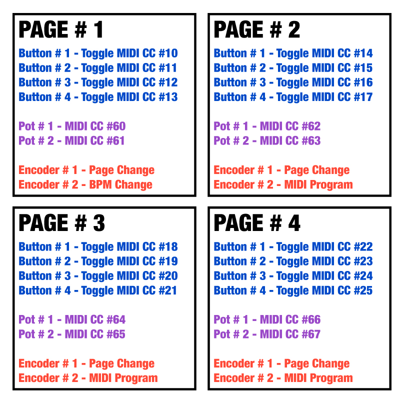

*Under MIT license.*

[Official BMC Website >> RoxXxtar.com/bmc](https://www.roxxxtar.com/bmc)

[< Back to Documentation](README.md)

# Pages/Layouts

In BMC a page holds all the events for each piece of hardware. You can also think of a page as a Layout.

When you change pages you change the events of buttons/leds/etc.

Pages Hardware include:
* Buttons
* Encoders
* Pots
* Leds
* PWM Leds
* Pixels
* RGB Pixels

As an example you can think of a build with 4 buttons, in Page 1 all buttons are set to send Program Changes,
in Page 2 all buttons can be set to send Control Changes, in Page 3 two buttons could send Program Changes,
one button could send Control Change and one could send a Note On and on Page 4 they do nothing.

If you set a Button or Encoder to change pages then when the page is changed that button/encoder would have a new event.
For this reason you would have to set that button/encoder to have the same page change event on all pages.

Each page also can have a name compiled.

### Non-Page Hardware (Global)

You may additionally compile Global items, ***these are NOT part of pages***. For example, a Global Button will not change it's event when there's a page change and will have the same function thruout the run time unless you change it with the editor.

Relays are NOT part of pages, they are Global.

Global Hardware include:
* Global Buttons
* Global Encoders
* Global Pots
* Global Leds
* Latching Relays
* Non-Latching Relays

Hardware in Pages takes up more EEPROM since each page holds editable data for each piece of hardware.

If you have hardware that is meant to have the same function at all times then you can set these are Global.

An example would be a Global Button that will scroll pages.

Hopefully this image below will help you understand how Pages and Global Data are separate.



### API
There are many API callbacks and functions available for use, these may not reflect the latest version

##### FUNCTIONS
```c++
// get the current page number
uint8_t getPage();
// go to a new page
// @reassignSettings if true will reassign all global settings
void setPage(uint8_t page, bool reassignSettings=false);
// scroll to a different page, either the previous or next page
void scrollPage(bool t_up, bool t_endless,
                uint8_t t_min, uint8_t t_max,
                uint8_t t_amount);

// change to a new page.
// if n is not a valid page number, nothing happens
// if n is the same as the current page, nothing happens
void changePage(uint8_t n);

// get the current page
uint8_t getCurrentPage();

// retrieve the name of the current page,
// must pass a pointer to your string with length >= BMC_NAME_LEN_PAGES
void getPageName(char* t_string);

// retrieve the name of the a page specified by n,
// must pass a pointer to your string with length >= BMC_NAME_LEN_PAGES
void getPageName(uint8_t n, char* t_string);

// move to the next page
// if endless is true and you are already on the last page, you will go to the first page
void pageUp(bool endless=true);

// move to the previous page
// if endless is true and you are already on the first page, you will go to the last page
void pageDown(bool endless=true);
```
##### CALLBACKS
```c++
// triggered when you change pages, also triggered when BMC runs it's first loop
void onPageChange(void (*fptr)(uint8_t page));
```
