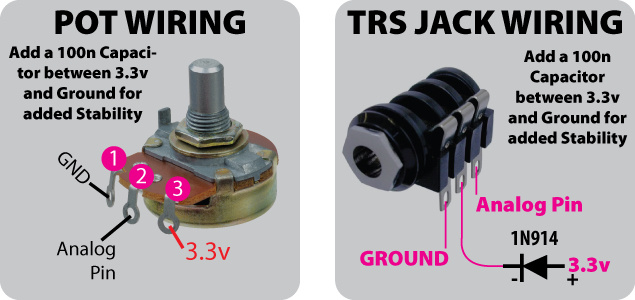

*Under MIT license.*

[Official BMC Website >> RoxXxtar.com/bmc](https://www.roxxxtar.com/bmc)

[< Back to Documentation](README.md)

# Pots
BMC has support for potentiometers, resolution is dropped to 7-bit for MIDI and tons of events are available. **Note: if you will be using any other peripherals like Displays or Pixels that use 5V from your Teensy, then you should use a large Electrolytic Capacitors between 5V and Ground, this is mainly to prevent noise in the pots from the surge from the 5V line. Start at 100uF or larger**



### API
There are many API callbacks and functions available for use, these may not reflect the latest version

##### FUNCTIONS
```c++
// Get POT Data on current page
void getPot(uint8_t n, bmcStorePot& t_item);

// Get POT Data on specified page
void getPot(uint8_t t_page, uint8_t n, bmcStorePot& t_item);

// get pot name on current page passing a pointer string
void getPotName(uint8_t n, char* t_string);

// get pot name on specified page passing a pointer string
void getPotName(uint8_t t_page, uint8_t n, char* t_string);

// start/stop pot calibration, pot calibration data is global
// so the calibration set is for that pot no matter what page you are in.
bool calibratePot(uint8_t n);
```

##### CALLBACKS
```c++
// triggered when a pot is rotated
void onPotActivity(void (*fptr)(uint8_t index, uint8_t value, bmcStorePot data));

// triggered when a global pot is rotated
void onGlobalPotActivity(void (*fptr)(uint8_t index, uint8_t value, bmcStorePot data));

// triggered when a custom pot event is handled
void onPotCustomActivity(void (*fptr)(uint8_t index, uint8_t byteA, uint8_t byteB, uint8_t byteC, uint8_t t_value));

// triggered when a custom global pot event is handled
void onGlobalPotCustomActivity(void (*fptr)(uint8_t index, uint8_t byteA, uint8_t byteB, uint8_t byteC, uint8_t t_value));

// for user defined events, includes page and global led, pwm leds, pixels and rgb pixels
void onPotsUserEvent(void (*fptr)(uint8_t n, uint32_t event, uint8_t ports, uint8_t value));
```
