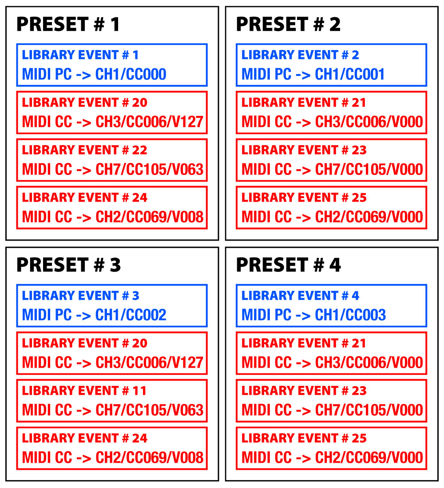

*Under MIT license.*

[Official BMC Website >> RoxXxtar.com/bmc](https://www.roxxxtar.com/bmc)

[< Back to Documentation](README.md)

# Presets
BMC Presets are basically collections of Library Events, you can compile presets to have up to 16 library events, you can also enable a startup preset which obviously will be executed upon BMC starting up. These are Global and do not change with page changes.

BMC has a typedef `bmcPreset_t` this will be either a `uint8_t` if the maximum number of presets compiled is 255 or less and `uint16_t` if the maximum number of presets compiled is higher than 255.

The same foes for the library in which case theres a typedef `bmcLibrary_t` which is a `uint8_t` if the library is equal to or less than 255 and a `uint16_t` if it's more than 255.

In either case this is to use less RAM/EEPROM depending of the size of the library and number of presets compiled.

BMC presets are also broken into banks, you select how many presets you want per bank in the config file maker, however, the maximum number of banks is locked at 255 and the maximum number of presets per bank is also and the output of (banks * presetsPerBank) can not exceed BMC_MAX_PRESETS.

Below is an example of how Library Events are part of Presets.



### API
There are many API callbacks and functions available for use, these may not reflect the latest version

##### FUNCTIONS
```c++
// retrieve the current preset name
void getPresetName(char* t_string);

// retrieve a preset name
void getPresetName(bmcPreset_t n, char* t_string);

// get how many library messages this preset has
uint8_t getPresetLength(bmcPreset_t n);

// get a library message id
bmcLibrary_t getPresetItem(bmcPreset_t n, uint8_t e);

// get the current preset number
bmcPreset_t getPreset();

// get the current preset bank
uint8_t getPresetBank();

// get the index of the current preset on the current bank
uint8_t getPresetInBank();

// change to a preset
void setPreset(bmcPreset_t n);

// go to the next preset
void presetUp(bool endless);

// go to the previous preset
void presetDown(bool endless);

// preset in bank
void setPresetBank(uint8_t n);

// switch to a specific preset in a specific bank
void setPresetInBank(uint8_t n, uint8_t b=255);

// go to next bank
void presetBankUp(bool endless);

// go to previous bank
void presetBankDown(bool endless);

// go to next preset in current bank
void presetInBankUp(bool endless);

// go to previous preset in current bank
void presetInBankDown(bool endless);
```
##### CALLBACKS
```c++
// triggered when a BMC Preset has changed
void onPresetChange(void (*fptr)(bmcPreset_t n));

// triggered when a BMC Preset Bank has changed
void onPresetsBankChange(void (*fptr)(uint8_t n));
```
