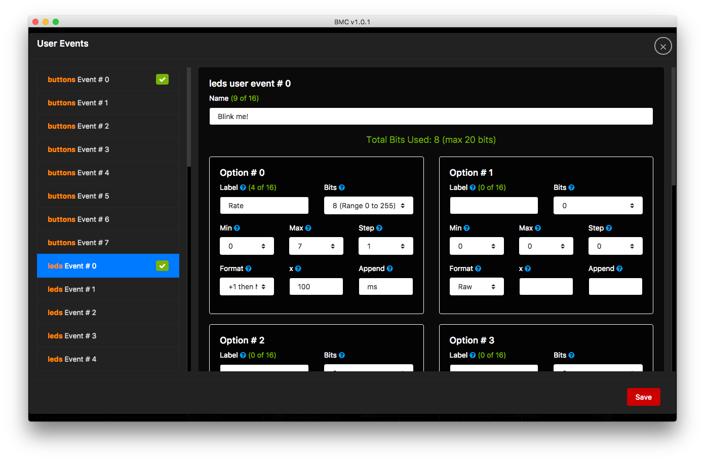
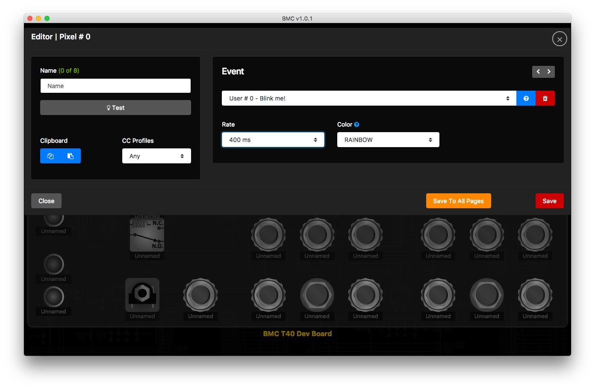

*Under MIT license.*

[Official BMC Website >> RoxXxtar.com/bmc](https://www.roxxxtar.com/bmc)

[< Back to Documentation](README.md)

# User Defined Events (Advanced)
All hardware in BMC is made up of **Events**, these is what tells a Button/Led/Encoder/Pot what to do.
For example an LED can have an **Event** that tells to turn on if we are in MIDI Program # 0 in Channel # 5, or a Button can have an **Event** that tells it to Send MIDI Control # 6 on Channel # 2 with a Value of 68.

BMC has a ton of pre-defined **Events** with all the most basic functionality needed for a typical MIDI Controller, however there may be times when you want to add code to your sketch to handle your own **Events**, maybe you want an LED to blink at a very specific rate, or a button to send a large custom midi system exlusive message, etc. For this situations BMC has **User Events**.

The library and the Editor App work hand in hand to give you customized **User Events** so that you can edit the data encoded into these events however you want.

There are 8 **User Events** for Buttons, Leds, Encoders, Pots & Relays, ech of these hardware types has 8 unique **User Events**, however these are shared across the same type of hardware, for example, you have 8 **User Events** for Buttons, these would also apply to Global Buttons, then you have 8 **User Events** for Leds, these also are used for Pixels, Globals Leds, RGB Pixels and PWM Leds.

To create your **User Events** first head to the Editor App, under **Local** click on user events, there select the hardware type and the **User Event** number, you will be able to create up to 8 *Select* dropdowns each with a specific number of bits that will be used, a min/max/step range and custom formatting for the way they are displayed.

Once you have created your Custom Events you can now use Callbacks on sketch which will carry the event data, you can then decode the data in the same maner that you specified in the editor to be encoded.

LED type **User Events** callbacks must return a value, when that callback returns 0 the led/pixel will turn off, when it returns 1 it will be turned on.

The editor app always encodes all the event data into 32 bits, with 8 of those bits making up the event type ("control change", "program change", etc.) so **User Events** will let you utilize up to 24 bits of those 32 bits, with Led **User Events** you can only use 20 of those bits as the last 4 bits are reserved for PWM Led Brightness and Pixel Colors, additionally Page and Global Leds use 1 bit for the "Blink" setting.

With the editor app you can allocate these 20/24 bits into unique values to use within your sketch.


##### User Event Editor (UI may change)

##### User Event Assigned to a Pixel (UI may change)



### API
There are many API callbacks and functions available for use, these may not reflect the latest version

##### EXAMPLE SKETCH
```c++
#include <BMC.h>

BMC_DEFAULT();

// a timer to blink the led
elapsedMillis ledCutomTimer;
// the state of the led
uint8_t turnCustomLedOn = 0;

void setup(){
  // init bmc
  bmc.begin();
  // add callback
  bmc.onLedsUserEvent(onLedsUserEvent);
  // reset timer
  ledCutomTimer = 0;
}

// @n = user event index
// @event = 32-bit event data, first (lsb) 8-bits are the event type so either
//          right shift it 8 spaces or always read bits starting at bit 8
// @ledType = the type of led that is triggering the callback

// accepted values for ledType:

// BMC_LED_TYPE_PAGE        = page led
// BMC_LED_TYPE_GLOBAL      = global led
// BMC_LED_TYPE_PWM         = PWM led
// BMC_LED_TYPE_PIXEL       = pixel
// BMC_LED_TYPE_RGB_RED     = rgb pixel Red event
// BMC_LED_TYPE_RGB_GREEN   = rgb pixel Green event
// BMC_LED_TYPE_RGB_BLUE    = rgb pixel Blue event
uint8_t onLedsUserEvent(uint8_t n, uint32_t event, uint8_t ledType){
  if(n==0){// it's led user event # 1
    // we'll get the first 8-bits after the event type
    // BMC_GET_BYTE is taking the second byte from event, if we wanted the
    // first byte (8-bits) then we would do BMC_GET_BYTE(0, event)
    uint8_t ev = BMC_GET_BYTE(1, event);
    // now we take that rate and add 1 then multiply it by 100
    // this means a value of 0 will turn into 100, which we'll use as milliseconds
    // a value of 1 will be 200, etc.
    if( ledCutomTimer >= (rate+1) * 100) ){
      // the threshold time has passed, reset the timer
      ledCutomTimer = 0;
      // flip the state of the led, 0 is off, 1 is on
      turnCustomLedOn = turnCustomLedOn==0?1:0;
      // return the new state of the led
      return turnCustomLedOn;
    }
  }
  // a value of 255 will be ignored completely
  // always return 255 for best results
  // Additionall you can return other values
  // 0 will turn led off
  // 1 will turn led on, for PWM Leds the brightness will be use, Pixels the color.
  // 2 will "pulse" the led
  // 3 will blink page and global leds, for pixels it will turn on RAINBOW and turns PWM leds to their set brightness
  // a value between 4 and 131 will apply only to PWM Leds, this value will have 4 substracted
  // then the remainder will be used as the Brightness of the Led, you could use this to fade a PWM led!
  // a value of 255 will be ignored, this is to avoid changing the state of the led,
  // for example if going to be pulsed then you want to return 255 if the conditions
  // that are supposed to pulse the led are not met, otherwise the led will remain on.

  // You can also use the following defined:
  // BMC_OFF_LED_EVENT
  // BMC_ON_LED_EVENT
  // BMC_PULSE_LED_EVENT
  // BMC_BLINK_LED_EVENT
  // BMC_IGNORE_LED_EVENT
  return 255;
}

void loop(){
  bmc.update();
}
```

##### FUNCTIONS
```c++
// to aid in decoding the data of the event BMC has the macro
BMC_GET_BITS_VALUE(value, fromBit, toBit);
// this macro will take the specified bits and return their value.
```

##### CALLBACKS
```c++
// for user defined events, includes page and global
// @n user event index
void onButtonsUserEvent(void (*fptr)(uint8_t n, uint32_t event, uint8_t ports, uint8_t mode));

// for user defined events, includes page and global encoders
// @n user event index
void onEncodersUserEvent(void (*fptr)(uint8_t n, uint32_t event, uint8_t ports, uint8_t mode));

// for user defined events, includes page and global led, pwm leds, pixels and rgb pixels
// @n user event index
void onPotsUserEvent(void (*fptr)(uint8_t n, uint32_t event, uint8_t ports, uint8_t value));

// for user defined events, includes page and global
// this callback must return a byte
// 0 will turn led off
// 1 will turn led on, for PWM Leds the brightness will be use, Pixels the color.
// 2 will "pulse" the led
// 3 will blink page and global leds, for pixels it will turn on RAINBOW and turns PWM leds to their set brightness
// a value between 4 and 131 will apply only to PWM Leds, this value will have 4 substracted
// then the remainder will be used as the Brightness of the Led, you could use this to fade a PWM led!
// a value of 255 will be ignored, this is to avoid changing the state of the led,
// for example if going to be pulsed then you want to return 255 if the conditions
// that are supposed to pulse the led are not met, otherwise the led will remain on.
// @n user event index
void onLedsUserEvent(uint8_t (*fptr)(uint8_t n, uint32_t event, uint8_t type));

// for user defined events
// this callback must return valid relay command, these are
// BMC_RELAY_RESET (put relay in reset or Normally Open position)
// BMC_RELAY_SET (put relay in set or Normally Closed position)
// BMC_RELAY_TOGGLE (toggle the current state of the relay)
// @n user event index
void onRelaysUserEvent(uint8_t (*fptr)(uint8_t n, uint32_t event));
```
